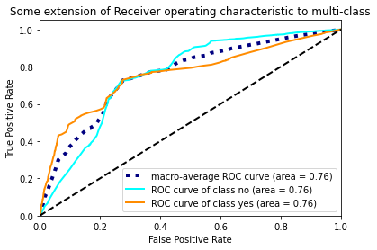
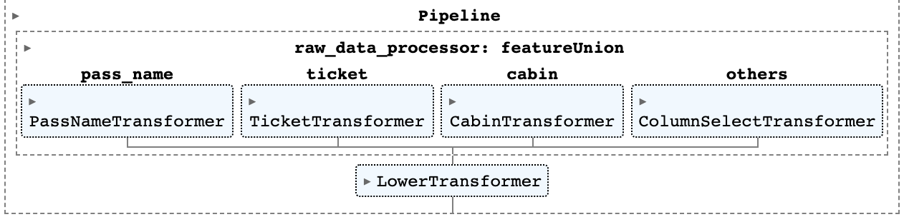
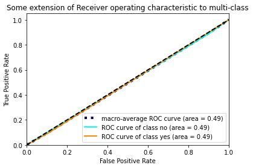

# pandas-sklearn-toolkit

Toolkit for an easy use of pandas, sklearn and popular ml libraries. Some features that PSkit provides are:
1. Base class for easier experimentation
2. Sklearn pipelines that works with pandas
3. Simple classes that support other analyses

## 1. Base classifier for experimentation

Inherit from `ExperimentBaseClassifier` to enable `evaluate()` method on your classifier, which show both classification report and AUC report for multi-class classification! Example code:

```python
# Import
from pskit.base import ExperimentBaseClassifier
from sklearn.model_selection import train_test_split
# Define your classifier
class NewClassifer(ExperimentBaseClassifier):
    def __init__(self, *args, **kwargs):
        super().__init__(*args, **kwargs)
    def fit(self, X, y):
        """Define your fit method here"""
        pass
# Test with data
data = pd.read_csv("data/file_name.csv")
X_train, X_test, y_train, y_test = train_test_split(
    data.drop(columns=['response']),
    data['response'])
new_clf = NewClassifier()
new_clf.fit(X_train, y_train)
new_clf.evaluate(X_test, y_test)
```

The output might look similar to:

```
Classification report:
              precision    recall  f1-score   support

          no       0.89      1.00      0.94      9146
         yes       0.00      0.00      0.00      1151

    accuracy                           0.89     10297
   macro avg       0.44      0.50      0.47     10297
weighted avg       0.79      0.89      0.84     10297

AUC: 
no: 0.7551160126022057
yes: 0.7551160126022057
```


## 2. Sklearn pipelines that works with pandas

Sklearn pipeline is great, it helps abstract the whole pipeline into a single trainable model. It enables unit testing and plug-and-play experiments for data scientists. Pipeline is super helpful with parameter tuning and model selection, where different models might need different preprocessing components but we still wants to compare them in a single cross-validation experiment.

However, Sklearn pipeline only work with numpy arrays, not Pandas' dataframes. That would be a problems for models that relies on column names as a source of information to guide the pre-processing process. PSkit fix this by including `KFeatureUnion` and `KColumnTransformer`, two pipeline classes that preserve **name** and **dtype** of dataframe columns.

Example code:

```python
# In:
from pskit.pipeline import KFeatureUnion
from sklearn.base import TransformerMixin, BaseEstimator
class ColumnSelectTransformer(BaseEstimator, TransformerMixin):
    def __init__(self, columns=None):
        super().__init__()
        self.columns=columns
    def fit(self, X, y=None):
        return self
    def transform(self, X):
        return X[self.columns]

col_processor = KFeatureUnion(transformer_list=[
    ('pass_name', PassNameTransformer()),
    ('ticket', TicketTransformer()),
    ('cabin', CabinTransformer()),
    ('others', ColumnSelectTransformer(columns=[c for c in original_features if c not in ('name', 'ticket', 'cabin')]))
    ]
)
pl = Pipeline(steps=[
    ('raw_data_processor', col_processor),
    ('lower_text_values', LowerTransformer())
])
pl

# Out:
```


For mode detailed example using the Titanic dataset, refer to [pipeline_titanic.ipynb](notebooks/pipeline_titanic.ipynb)

## Supports for other tasks

Example: Learning difficulty assessment. PSkit support this assessment with some basic simple models, namely `RandomClassifier` and `UnivariateLogisticRegression`, to serve as baseline for more sophisticated algorithms that the data scientists might develop.

```python
from pskit.simple_models import UnivariateLogisticRegression, RandomClassifier
from sklearn.model_selection import train_test_split
# Random classifier
rc = RandomClassifier()
rc.fit(X_train, y_train)
rc.evaluate(X_test, y_test)

# Out:
```
```
Evaluating model
              precision    recall  f1-score   support

          no       0.89      0.89      0.89      9146
         yes       0.10      0.10      0.10      1151

    accuracy                           0.80     10297
   macro avg       0.49      0.49      0.49     10297
weighted avg       0.80      0.80      0.80     10297

AUC:
no: 0.49381768636709666
yes: 0.4938176863670967
```


```python
# Univariate logistic regression. 
ulr = UnivariateLogisticRegression()
ulr.set_col('euribor3m') # We choose `euribor3m` since we see some difference in mean and median
ulr.fit(X_train, y_train)
ulr.evaluate(X_test, y_test)

# Out:
```
```
              precision    recall  f1-score   support

          no       0.89      1.00      0.94      9146
         yes       0.00      0.00      0.00      1151

    accuracy                           0.89     10297
   macro avg       0.44      0.50      0.47     10297
weighted avg       0.79      0.89      0.84     10297

AUC:
no: 0.7551160126022057
yes: 0.7551160126022057
```


We can see AUC improve significantly from random model to a simple model. However, accuracy, precision, recall, and f1_score doesn't have better performance. 

=> Thus, we can have initial conclusion that the classification problem is not hard to learn, but at the same time have a lot of potential to improve performance.

For mode detailed version of this analysis using the Bank Marketing dataset, refer to [learning_difficulty_assessment.ipynb](notebooks/learning_difficulty_assessment.ipynb)